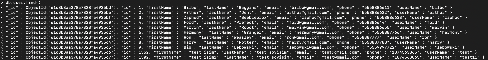
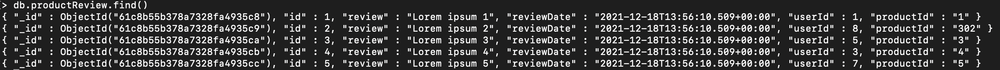
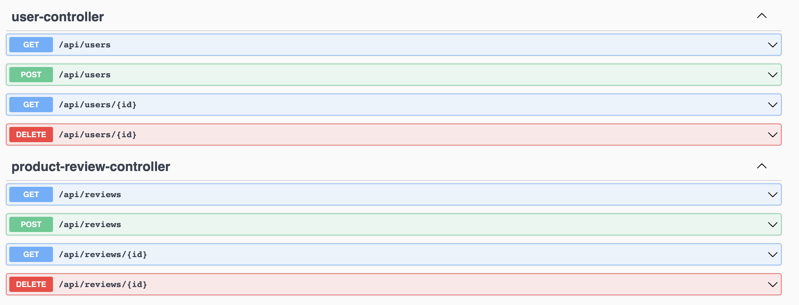
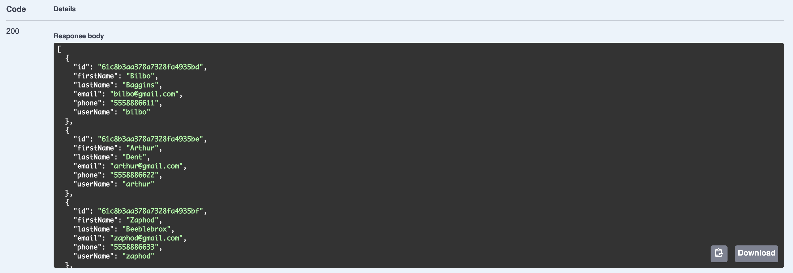
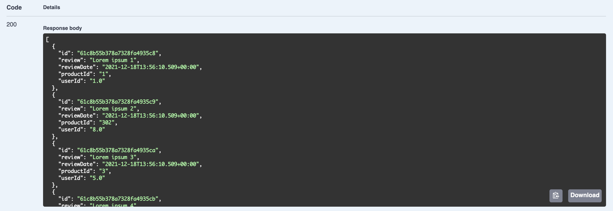
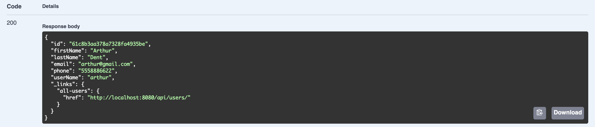
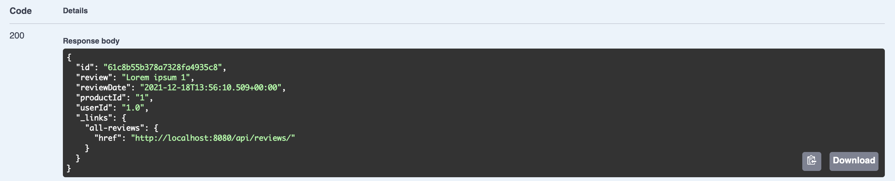
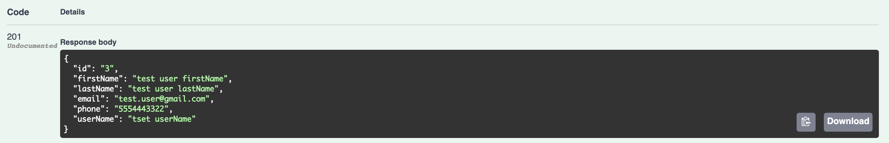
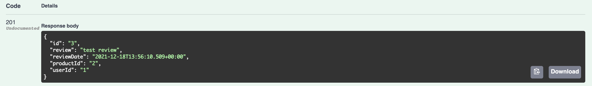

# third-homework

## Introduction

In this assignment, user and product comment collections were added on mongo db and get, post and delete operations were performed.
Swagger was used as API document and necessary tests were performed with this tool.


For a quick start to mongo db and more information, you can visit this link: 
[Connect to MongoDB](https://docs.mongodb.com/guides/server/drivers/)

## Answers

### Question 1: Add User and ProductReview Collections to Mongodb
First, used the following command for create a db on mongodb:

    > use n11

Collections were created using the following commands:

    > db.createCollection("collectionName")

Then, inserted datas to user and product review collections using the following commands:

    > db.collectionName.insert(//json value)

Now we can see the data we added with the following command:

    > db.collectionName.find()

The data in user collection:



The data in productReview collection:


### Question 2: Write Repositories and Entity Services

There are necessary codes in the repository and service directories within the project.

### Question 3: Write the controllers

There are necessary codes in the project's controller directory. 
The outputs look like this with swagger:



#### Question 3.1: findAll

When the necessary codes were written, the following conclusion was reached:

For ```user```  collection:



For ```productReview```  collection:



#### Question 3.2: findById

When the necessary codes were written, the following conclusion was reached:

For ```user```  collection:



For ```productReview```  collection:



#### Question 3.3: save

When a json data is sent as the request body, the registration process is performed in the database and the response code ```201``` created status is returned.

For ```user```  collection:



For ```productReview```  collection:



When we call findAll for each collection, we can see the user and review we added.

#### Question 3.4: delete

When we give the user and product comment id that we want to delete as a parameter, we can see that the data has been deleted with the findAll endpoint.


